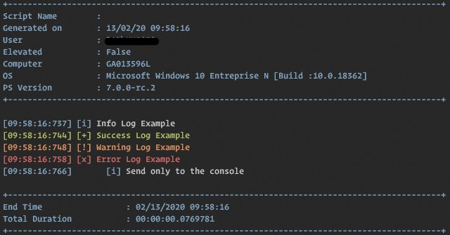
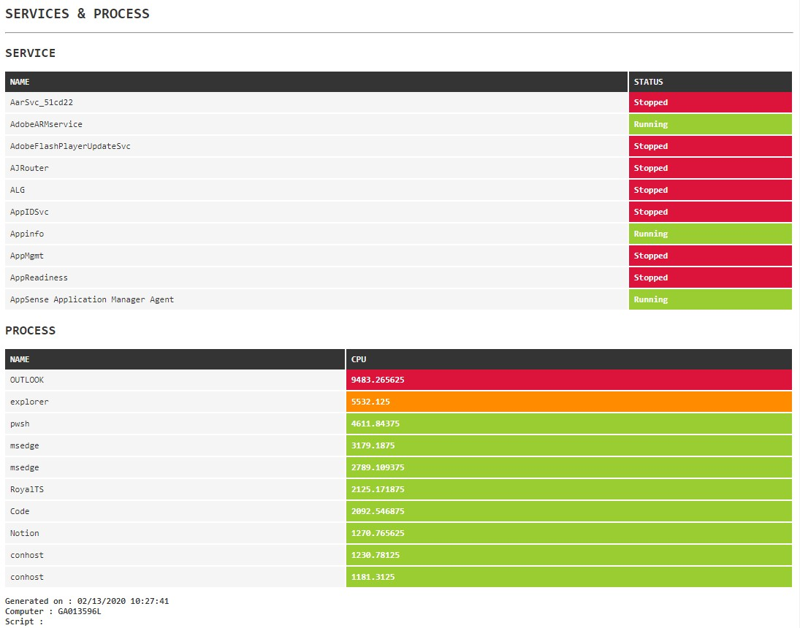
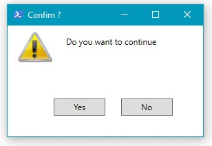
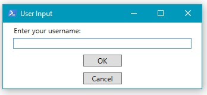
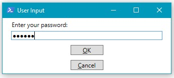
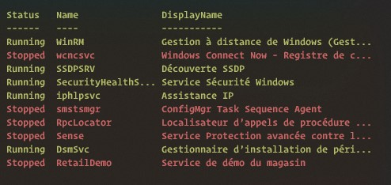
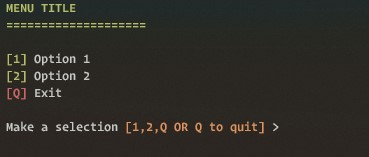

# :wrench: JM.ScriptTools

Some PowerShell helpers functions to shorten and speed up console and scripts work.

## Installation

You can get the current release from this repository or install this from the PowerShell Gallery:

```powershell
iex ((New-Object System.Net.WebClient).DownloadString('https://raw.githubusercontent.com/Reyozam/JM.ScriptTools/master/InstallModule.ps1'))
```


## Functions

### Write-Log

This function output formatted log event to console, logfile or both.

```powershell
Write-Log -StartLog -LogFile $LogFile;
Write-Log -Level Info -Message "Info Log Example" -LogFile $LogFile;
Write-Log -Level Success -Message "Success Log Example" -LogFile $LogFile;
Write-Log -Level Warning -Message "Warning Log Example" -LogFile $LogFile;
Write-Log -Level Error -Message "Error Log Example" -LogFile $LogFile;
Write-Log -Level Info -Message "Send only to the console" -Tab 3;
Write-Log -EndLog -LogFile $LogFile
```



###### LogFile Output :

```
[10:02:05:155] [INFO   ] Info Log Example
[10:02:05:158] [SUCCESS] Success Log Example
[10:02:05:163] [WARNING] Warning Log Example
[10:02:05:167] [ERROR  ] Error Log Example
```

### Out-HTMLReport

This function can generate conditional formatted HTML Table to build some fancy report. 

```powershell
$Service_Conditions = @{
    name       = "Status"
    expression = { $_.Status }
    css        = { if ($_.Status -eq "Stopped") { 'red' } else { 'green' } }
}

$Process_Conditions = @{
    name       = "Cpu"
    expression = { $_.cpu }
    css        = { if ($_.cpu -gt 7000) { 'red' } elseif ($_.cpu -gt 5000) { 'orange' } else {"green"} }
}

$FragmentsService = Get-Service | Select-object -first 10  | Out-HTMLReportFragment -PreContent "Service" -Properties name,$Service_Conditions

$FragmentProcess = Get-Process | Sort-Object cpu -Descending | Select-Object -first 10 | Out-HTMLReportFragment -PreContent "Process" -Properties name,$Process_Conditions

$HTMLCode = Out-HTMLReport -HTMLFragments $FragmentsService,$FragmentProcess -Title "Report" -PreContent "Services & Process" | Out-File $env:USERPROFILE\Desktop\TestHTML.html

```




### Write-ProgressBar

This function output a CLI progress bar in the console

```powershell
for ($i = 0; $i -lt 100; $i++) {
 Write-ProgressBar -Activity "Job Running ..." -Progress $i
}
```


### Send-Notification

This function can trigger Windows Pop-up Notification

```powershell
Send-Notification -Title "Finish" -Message "Your script has done his job" -BalloonIcon Info
```


### Invoke-MessageBox

This function will show customizable GUI Message Box 

```powershell
Invoke-MessageBox "Do you want to continue" -Buttons YesNo -Title "Confim ?" -Icon Warning
```



### Invoke-InputBox

This function will show customizable GUI Input Box 

```powershell
Invoke-InputBox -Title "User Input" -Message "Enter your username:"
Invoke-InputBox -Title "User Input" -Message "Enter your password:" -AsSecureString
```





### Out-TableColor

This function output conditional formatted object

```powershell
Get-Service | Out-TableColor -PropertyConditions @{"Stopped"="red";"Running"="green"} -Property status
```




### Write-Menu

This function show menu from an hashtable template

```powershell
$Menu = @{

    Title = "Menu Title"

    "1"   = @{
        Label  = "Option 1"
        Action = { Write-Host "You choose Option 1" }
    }

    "2"   = @{
        Label  = "Option 2"
        Action = { Write-Host "You choose Option 2" }
    }

}

Write-Menu -MenuHashtable $Menu
```




### Get-RunInfo

This function output some information about current context information

```powershell
>Get-RunInfo

User            : *Domain\Username*
Elevated        : False
Computername    : *computername*
OperatingSystem : Microsoft Windows 10 Entreprise N [64 bits]
BuildNumber     : 1903
BuildVersion    : 10.0.18362
PSVersion       : 5.1.18362.145
Edition         : Desktop
PSHost          : ConsoleHost
WSMan           : 3.0
ExecutionPolicy : Bypass
Culture         : fr-FR
```


### Get-Choice

This function ask for a choice 

```powershell
> Get-Choice -Message "Are you sure?"

Confirm
Are you sure?
[Y] Yes  [N] No  [?] Aide (la valeur par défaut est « Y ») :
```

### Wait-Condition

This function allow to wait until a condition is met

```powershell
> Wait-Condition -Condition {Get-Process notepad -ErrorAction SilentlyContinue} -Timeout 20 -Verbose

COMMENTAIRES : Wait 20 seconds for the condition to be fulfilled
COMMENTAIRES : Condition not met after [1] seconds...
COMMENTAIRES : Condition not met after [2] seconds...
COMMENTAIRES : Condition not met after [3] seconds...
COMMENTAIRES : Condition not met after [4] seconds...
COMMENTAIRES : Condition not met after [5] seconds...
COMMENTAIRES : Condition not met after [6] seconds...
COMMENTAIRES : Condition met before timeout period.
```

### Watch-Folder

This function watch a folder an return filesystem event in it.

```powershell
Watch-Folder -Path C:\TEMP
```

